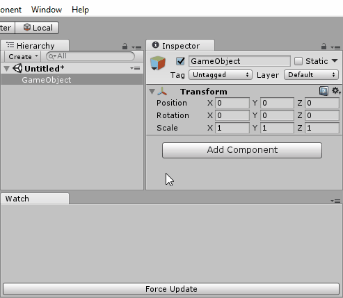

# Unity WatchTool Extension
This tool allows you to watch any variable from any MonoBehaviour via `[Watch]` attribute
## Usage

## Naming rules
```
[Watch] // GameObject and field names
public float angle = 7f;
	
[Watch("AwesomeRange")] // GameObject name and custom text
public float range = 7f;
	
[Watch("!Global")] // Custom text without GameObject name
public Vector3 global = Vector3.up;
```
